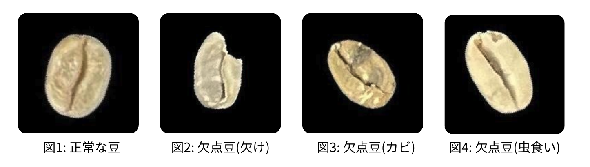
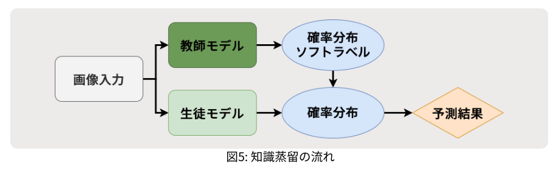
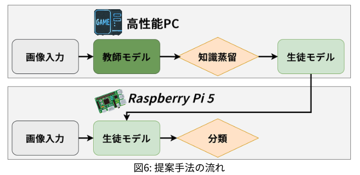
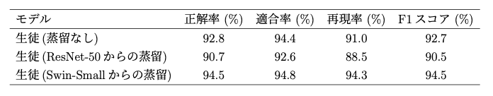
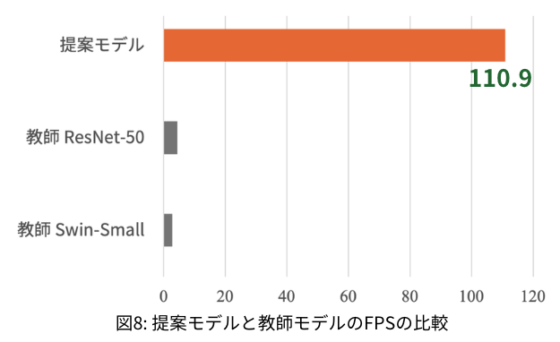

# coffee-defect-kd-edge

高専本科5年と専攻科で取り組んだ、深層学習と知識蒸留（Knowledge Distillation）を用いた、エッジコンピュータ（Raspberry Pi 5）向けコーヒー生豆欠陥検出システムの研究リポジトリです。

大規模な教師モデル（Swin Transformer Small, ResNet-50 など）から軽量な生徒 CNN へ知識蒸留を行い、Raspberry Pi 5 上でリアルタイム推論（約 9ms/枚, 約 110 FPS）を実現しています。独自に構築した 72,000 枚規模のコーヒー生豆画像データセットを使用しています。なお、本研究で作成したデータセットは GitHub リポジトリの容量上の問題で公開できていません。

本研究の概要は以下の README に記述しています。
本研究の詳細については、[スライド](docs/presentation_slide.pdf)や[論文](paper/full_paper/out/paper.pdf)をご覧ください。

## 索引

**研究概要について**

1. [研究背景・課題](#研究背景課題)
2. [研究目的](#研究目的)
3. [提案手法](#提案手法)
4. [技術選定と意図](#技術選定と意図)
5. [結果](#結果)

**ソースコード・実行について**

1. [環境構築](#環境構築)
2. [ディレクトリ構成](#ディレクトリ構成)
3. [configs/ — Hydra 設定ファイル](#configs--hydra-設定ファイル)
4. [src/ — ソースコード](#src--ソースコード)
5. [実行方法](#実行方法)

---

## ディレクトリ構成

```
.
├── README.md                 # 本ファイル
├── .python-version           # Python バージョン指定（3.13.3）
├── requirements.txt          # Python 依存パッケージ一覧
├── configs/                  # Hydra 設定ファイル群
├── src/                      # ソースコード（学習・蒸留・ユーティリティ）
├── docs/                     # README 用画像・スライドなどの資料
├── outputs/                  # 学習実行時の出力（ログ・モデル重み・グラフ等）
└── paper/                    # 論文・発表資料
```

---

## 研究背景・課題

コーヒー生豆の欠点豆とは、欠け・カビ・虫食いなどといったコーヒーの風味に影響を及ぼすものを指します。

<p align="center">
  
</p>
この欠点豆を取り除くための方法は様々あります。

中でもハンドピックという作業は人の手で欠点豆を取り除くもので、生産地や自家焙煎を行う店で主流となっています。  
ハンドピックには、

- 時間がかかる
- 労力がかかる
- 作業者間の判断のばらつきがある

といった課題を抱えています。(Carlito Pinto **_et al._**, 2017)  
この課題を解決するために、画像認識AIを用いた選別の研究が進められてきました。  
しかし、これらの既存研究のAIモデルを現場（工場内など）に導入する方法は主に二種類あり、それぞれに課題が残ります。

- クラウドやサーバーを利用する方法の課題
  - 利用コストが高い
  - 常時ネット接続が必要
  - 通信遅延で、リアルタイム性に欠ける

- 現場に大型PCや専用AI機器を設置する方法の課題
  - 導入コストや保守コストが高い
  - スペースの確保が必要
  - 消費電力が多い

近年は知識蒸留を用いた軽量化の検討も進んでいますが、コーヒー生豆欠陥検出において、CNN系教師モデルとTransformer系教師モデル（ViT系）を体系的に比較し、どちらが軽量生徒モデルへの知識転移に有効かを明確に示した事例は、私たちの調査範囲では報告されていません。

また、実際の現場導入を想定した場合、エッジデバイスには CPU・メモリ・電力の制約があるため、大規模モデルをそのまま搭載すると推論遅延が生じ、選別ラインの速度に追いつかないという課題があります。したがって、分類性能とリアルタイム性を同時に満たすモデル設計が必要です。

## 研究目的

本研究では、安価・小型なエッジコンピュータ上で動作し、ネット接続不要でリアルタイムに、欠陥を高精度に分類できるシステムを構築することを目的としています。

エッジコンピュータとは、工場や作業場などの現場（端）で処理が完結する小型コンピュータです。  
本研究では、

- 入手のしやすさ
- 機械学習で用いられるPythonを使える
- センサーなどをつけることができるGPIOピンがある

以上のことから Raspberry Pi 5 16GBを採用しました。

エッジコンピュータは、安価でネット接続が不要ですが、相対的に低性能です。 そのため、高性能なAIモデルを動作させると、計算量が膨大なため、動作が遅かったりそもそも動かないといった問題があります。

一方で、軽量なAIモデルを動作させると、早くは動きますが低性能です。 このギャップを埋めるために、知識蒸留という技術を用います。
知識蒸留とは、賢いAIモデルを教師、軽量なAIモデルを生徒とし、教師モデルの出力分布を学習目標に、生徒モデルに知識を転移する手法です。

<p align="center">
  
</p>

## 提案手法

提案手法の全体の流れは以下の図のようになっています。

1. 知識蒸留により、教師モデルの知識を生徒モデルに転移
2. 転移した生徒モデルをRaspberry Pi 5上で動かし分類する

<p align="center">
  
</p>

教師モデルは、CNN系およびVision Transformer（ViT）系のモデルを候補とし、事前実験で高い性能を示した ResNet-50（CNN）と Swin-Small（ViT）について、知識蒸留後の性能を比較したうえで、優れた方のモデルを採用します。  
生徒モデルは、カスタマイズした軽量CNNを用いました。

また、データセットは自作で、正常な豆と欠点豆の2値分類タスクとなっています。
手動で2,000個を検査し、データ拡張により72,000枚としました。

## 技術選定と意図

### なぜエッジコンピュータ前提にしたのか

本研究では、コーヒー生豆の欠点豆検出を、単に高精度に分類できる技術として終わらせるのではなく、実際の選別現場で利用できるシステムにすることを重視しました。  
コーヒー生豆の選別は、作業者の経験や集中力に依存しやすく、時間的・身体的な負担も大きい作業です。そのため、現場の人たちが抱えている「時間や労力の負担が大きい」「判断にばらつきがある」といった課題を、技術によって少しでも解決したいという思いがありました。

この目的を実現するには、高性能なPCやクラウド環境で動作するだけでは不十分です。  
実際の生産地や小規模な焙煎所では、高価なGPU環境を常に用意できるとは限らず、ネットワーク環境も安定しているとは限りません。
そのため、低コストで導入しやすく、撮影した画像をその場でリアルタイムに処理できるエッジコンピュータ上で動作することに価値があると考えました。

### なぜ知識蒸留を用いたのか

エッジコンピュータ上でAIモデルを動作させる場合、計算資源やメモリ容量に制約があるため、大規模な高性能モデルをそのまま使用することは難しいです。一方で、欠点豆検出では品質管理の観点から高い分類性能も求められます。  
そこで本研究では、高性能な教師モデルの知識を、軽量な生徒モデルへ転移するために知識蒸留を用いました。

知識蒸留を用いることで、学習時には高性能な教師モデルの出力分布を利用し、推論時には軽量な生徒モデルのみを動作させることができます。
これにより、推論速度やメモリ使用量を抑えながら、軽量モデル単体で学習する場合よりも高い性能を目指すことができます。

つまり、知識蒸留は本研究において、分類性能と軽量性のトレードオフを緩和するための技術として採用しました。

### なぜ教師モデルを決める際にCNN系とTransformer系を比較したか

教師モデルの性能や特徴表現は、生徒モデルに転移される知識の質に影響すると考えられます。
そのため、異なる特徴抽出の性質を持つモデルを比較する必要があると考えました。

画像認識の分野では、長年 CNN が標準的な手法として広く用いられてきました。CNN は畳み込み処理により、画像の局所的な特徴を抽出することに優れており、豆表面の一部に現れる欠陥を捉えるのに適していると考えました。

一方で、近年は自然言語処理分野で発展したTransformerを画像認識に応用したVision Transformer（ViT）が登場し、画像分類においても高い性能を示すようになりました。
Transformer系モデルは、自己注意機構により、画像内の離れた領域同士の関係や、画像全体の大域的な特徴を捉えやすいといった特徴があります。コーヒー生豆の欠陥には、局所的な異常だけでなく、豆全体の形状、色味、質感が関係するものもあるため、Transformer系モデルの特徴表現も有効である可能性があると考えました。

そこで本研究は、従来からのスタンダードであるCNN系モデルと、近年注目されているTransformer系モデルを教師モデル候補として比較しました。これにより、局所的な特徴を得意とするCNN系教師と、大域的な関係性を捉えやすいTransformer系教師のどちらが、軽量な生徒モデルへの知識蒸留に適しているかを検証しました。

### なぜ生徒モデルをCNNにしたのか

生徒モデルは、最終的にエッジコンピュータ上で実際に推論を行うモデルです。
そのため、生徒モデルには高い分類性能だけでなく、推論速度の速さ、メモリ使用量の少なさが求められます。

Transformer系モデルは、一般に CNN と比較して計算負荷やメモリ使用量が大きくなりやすいです。
そのため、計算資源に制約がある環境でリアルタイムに推論を行うモデルとしては、軽量な CNN の方が適していると判断しました。

### なぜ再現率を重視したのか

本研究では、欠点豆をどれだけ見逃さずに検出できるかが重要であるため、評価指標として再現率を重視しました。

欠点豆検出において、正常豆を欠点豆と誤判定することも問題ですが、欠点豆を正常豆として見逃してしまうと、その欠点豆が除去されずに残り、焙煎後の品質低下につながる可能性があります。特に、品質管理の観点では、欠点豆の見逃しは最も避けるべき誤りです。

再現率は、実際に欠点豆であるサンプルのうち、モデルが正しく欠点豆として検出できた割合を示す指標です。そのため、欠点豆の見逃しを評価する上で適していると考えました。

したがって、本研究では単純な正解率だけでなく、欠点豆を見逃さない性能を評価するために再現率を重視しました。

### なぜデータ拡張を用いたのか

実際の選別時には、コーヒー生豆は常に同じ向きや位置で撮影されるとは限りません。そのため、モデルが特定の向きや配置に依存して学習してしまうと、未知の画像に対する汎化性能が低下する可能性があります。

そこで本研究では、回転や反転によるデータ拡張を行いました。これにより、同じ豆であっても異なる向きや配置の画像として学習でき、モデルが豆の向きに過度に依存せず、欠陥の本質的な特徴を捉えやすくなります。

また、独自に収集できる画像枚数には限りがあるため、データ拡張によって学習データの多様性を増やすことも重要です。

つまり、データ拡張は、限られたデータから汎化性能の高いモデルを構築するために用いました。

### なぜPythonを用いたのか

本研究では、AIモデルの構築、学習、評価、データ処理を効率的に行う必要があったため、Python を用いました。

Python は本研究で用いた、PyTorch などの深層学習フレームワークや、OpenCV、NumPy、pandas、psutil などの画像処理・数値計算・評価用ライブラリが充実しています。そのため、AIモデルの学習からデータ処理、評価までを一貫して実装しやすいです。

また、Python は実験条件を変更しながら比較検証を行う用途にも適しており、モデル構造や損失関数、ハイパーパラメータを柔軟に変更できます。

したがって、本研究では、深層学習を用いた実装・実験・評価を効率的に進めるために Python を採用しました。

## 結果

### 知識蒸留後の生徒モデルの分類性能検証

以下の表は、知識蒸留後の生徒モデルの分類性能を検証した結果です。  
この比較で使用した評価指標は以下の4つです。

- 正解率
  - 全サンプル中で正しく分類された割合を示す指標です。
  - 正解率は「当たったかどうか」しか見ないため、偽陽性（本当は陰性なのに陽性と誤判定）と偽陰性（本当は陽性なのに陰性と誤判定）のどちらが多いかを区別できません。
- 適合率
  - モデルが正と予測したサンプルのうち、実際に正であったサンプルの割合を示す指標です。
  - つまり、誤検出の少なさを表します。
- 再現率
  - 実際に正であるサンプルのうち、モデルが正しく検出できた割合を示す指標です。
  - つまり、取りこぼしの少なさを表します。
  - 本研究では、欠点豆の取りこぼしが重大な問題となるため、再現率を特に重視しています。
- F1スコア
  - 適合率と再現率の調和平均を示す指標です。
  - 適合率と再現率の両者のバランスを考慮した総合的な分類性能を評価することができます。

<p align="center">
  
</p>

この表から、Swin-Smallから知識蒸留した生徒モデルは、知識蒸留していないモデル・ResNet-50から知識蒸留したモデルよりも全てのスコアで上回ることがわかりました。  
そのため、Swin-Smallから知識蒸留したモデルを最終的な提案モデルとして採用しました。

### Raspberry Pi上での推論性能検証

以下の図は、提案モデルの Raspberry Pi 5 上での FPS 比較結果です。

FPSとは、単位時間あたりの処理可能枚数を表します。
一般に、リアルタイム処理では 30 FPS 以上が必要とされています。

<p align="center">
  
</p>

この図を見ると、提案モデルは教師モデルとして使用した Swin-Small、教師モデルの比較で使用した ResNet-50 の FPS を上回っていることがわかります。さらに、リアルタイム処理の基準である 30 FPS を大きく超える 110 FPS であることから、本提案モデルはリアルタイム処理が可能であると言えます。

### まとめ・今後の課題

本研究では、エッジコンピュータ上での高速かつ高性能なコーヒー生豆の欠点豆検出を実現できました。  
しかしながら、以下の課題が存在します。

- データセットがコーヒー生豆の片面のみを対象としている
  - 本研究で作成したデータセットはコーヒー生豆の片面のみを対象としているのに対し、実際の選別ラインでは、豆の両面を撮影する必要があるため、両面を考慮したモデルの設計と評価及びデータセットの収集方法の検討が必要です。
- 欠点豆の種類が限定的である
  - 本研究で作成したデータセットは、自作する必要があったため、判断のしやすい代表的な欠点豆に限定されています。
  - 実際の欠点豆は、さらに多様な種類が存在し、それらを網羅的に検出するためには、より多様な欠点豆を含むデータセットの収集と評価が必要です。
  - 今後は、コーヒー専門店などと連携し、多様な欠点豆を含む大規模データセットの構築を目指す必要があります。
- 完全な欠点豆検出には至っていない
  - 提案モデルは、再現率94.3%と高い性能を達成したものの、完全な欠点豆検出には至っていません。実際の選別ラインでは、品質のグレードが高くなるほど、欠点豆の混入が許されません。
  - 独自に計算した場合、最高グレードの基準では少なくとも99.8%以上の再現率で分類できる必要があります。そのため、今後はさらに分類性能を向上させることが求められます。
  - しかし、現状の提案モデルでも、94.3%の再現率を達成しているため、人間による選別の際の判断のばらつきや疲労によるミスを考慮すると、提案モデルは一定の性能で疲れることなく分類可能なため、実用上は十分に有用であると考えます。

---

## 環境構築

- Python 3.13.3（`.python-version` で指定）
- 依存パッケージのインストール:

```bash
pip install -r requirements.txt
```

---

## configs/ — Hydra 設定ファイル

[Hydra](https://hydra.cc/) を用いて、モデル・データセット・学習条件を YAML ファイルで管理しています。

```
configs/
├── config.yaml                    # 通常学習用メイン設定（src/train/train.py 用）
├── config_kd_cnn224.yaml          # 知識蒸留用設定: CNN224 生徒 + Swin 教師（AT+KD）
├── config_kd_cnn_student050.yaml  # 知識蒸留用設定: cnn_student（軽量版）+ Swin 教師（AT+KD）
├── config_kd_cnn_student100.yaml  # 知識蒸留用設定: cnn_student100 + Swin 教師（AT+KD）
├── config_kd_resnet.yaml          # 知識蒸留用設定: cnn_student100 + ResNet-50 教師（AT+KD, 複数層）
├── config_kd_resnet_soft.yaml     # 知識蒸留用設定: cnn_student100 + ResNet-50 教師（ソフトラベルのみ）
├── config_kd_soft.yaml            # 知識蒸留用設定: cnn_student100 + Swin 教師（ソフトラベルのみ）
├── data/                          # データセット設定
│   ├── bean_224.yaml              # 224×224 コーヒー生豆データセット（train/val/test パス・入力サイズ）
│   └── bean_180.yaml              # 180×180 コーヒー生豆データセット（train/val パス・入力サイズ）
├── model/                         # モデル定義設定（Hydra instantiate 用）
│   ├── cnn.yaml                   # 自作 CNN（180×180 入力）
│   ├── cnn224.yaml                # 自作 CNN（224×224 入力）
│   ├── cnn_student050.yaml        # 軽量生徒 CNN
│   ├── cnn_student100.yaml        # 生徒 CNN（3 ブロック構成）
│   ├── resnet18.yaml              # ResNet-18（timm 事前学習済み）
│   ├── resnet50.yaml              # ResNet-50（torchvision 事前学習済み）
│   ├── swin_b.yaml                # Swin Transformer Base
│   ├── swin_s.yaml                # Swin Transformer Small
│   ├── swin_t.yaml                # Swin Transformer Tiny
│   ├── deit_b.yaml                # DeiT Base
│   ├── deit_bd.yaml               # DeiT Base Distilled
│   ├── deit_s.yaml                # DeiT Small
│   ├── efficientnet_b0.yaml       # EfficientNet-B0
│   ├── mobilenetv2.yaml           # MobileNetV2
│   ├── mobilenetv2_050_np.yaml    # MobileNetV2 (width=0.5, 事前学習なし)
│   ├── mobilenetv2_np.yaml        # MobileNetV2（事前学習なし）
│   ├── tiny_vit.yaml              # TinyViT
│   ├── tiny_vit_np.yaml           # TinyViT（事前学習なし）
│   ├── vit.yaml                   # ViT
│   ├── vit_b16.yaml               # ViT-B/16
│   ├── vit_second.yaml            # ViT（別構成）
│   ├── vit_third.yaml             # ViT（別構成）
│   └── test.yaml                  # テスト用設定
└── train/                         # 学習条件設定
    ├── base.yaml                  # 基本設定（epochs: 100）
    ├── batchsize_finder.yaml      # バッチサイズ探索用
    ├── find_lr.yaml               # 学習率探索用（epochs: 100, lr: 0.001）
    ├── test.yaml                  # テスト用設定
    ├── test2.yaml
    └── test3.yaml
```

### 設定の仕組み

- `config.yaml` が通常学習（`src/train/train.py`）のメイン設定で、`defaults` で `data`, `train`, `model` を組み合わせます。
- `config_kd_*.yaml` は知識蒸留用の設定で、教師モデル（`teacher`）と蒸留パラメータ（`kd`）を追加で定義しています。
- 蒸留設定の `kd` セクションでは以下を指定します:
  - `T`: 温度パラメータ（ソフトラベルの滑らかさ）
  - `alpha`: KL ダイバージェンス損失の重み
  - `beta`: Attention Transfer (AT) 損失の重み（AT 使用時）
  - `teacher_feat` / `student_feat`: AT で比較する中間層の名前

---

## src/ — ソースコード

学習・知識蒸留・ユーティリティ・エッジ評価スクリプトが含まれます。

```
src/
├── train/                    # 通常学習スクリプト
│   ├── train.py              # cosine スケジューラ付き通常学習
│   └── train_without_scheduler.py # スケジューラなし通常学習
├── kd/                       # 知識蒸留用学習スクリプト群
│   ├── kd_swin_soft.py
│   ├── kd_resnet_hard.py
│   ├── kd_resnet_soft.py
│   ├── kd_cnn_224.py
│   ├── kd_cnn_student100.py
│   └── kd_cnn_student100_simple.py
├── utils/                    # 補助ユーティリティ
│   ├── eval_model.py
│   ├── lr_finder.py
│   ├── batchsize_finder.py
│   ├── batchsize_finder_kd.py
│   ├── normalize_finder.py
│   ├── normalize_value.txt
│   ├── view_model_detail.py
│   ├── download_models.py
│   └── download_models_no_pretrained.py
├── eval_on_raspberrypi/      # Raspberry Pi 5 向け評価
│   ├── eval_on_rasp.py
│   ├── benchmark_rpi5_results.csv
│   ├── student.pt
│   ├── distilled_from_swin.pt
│   └── distilled_from_resnet.pt
└── models/                   # モデル定義
    ├── cnn.py
    ├── cnn_224.py
    ├── cnn_student050.py
    ├── cnn_student100.py
    ├── resnet18.py
    ├── resnet50.py
    ├── swin_b.py
    ├── swin_s.py
    ├── swin_t.py
    ├── deit_b.py
    ├── deit_bd.py
    ├── deit_s.py
    ├── efficientnet_b0.py
    ├── mobilenetv2.py
    ├── mobilenetv2_050_np.py
    ├── mobilenetv2_np.py
    ├── tiny_vit.py
    ├── tiny_vit_np.py
    ├── vit_b16_pretrained.py
    ├── timm_cnn.py
    ├── timm_model.py
    └── old/
```

### 主要スクリプトの説明

#### `src/train/train.py` — 通常学習

Hydra で設定を読み込み、指定したモデルを train/val/test データで学習します。Cosine スケジューラ（10% ウォームアップ）付き。学習終了後にテストデータで Accuracy, Precision, Recall, F1, AUC を算出し、ROC 曲線・PR 曲線を保存します。

#### `src/train/train_without_scheduler.py` — 通常学習（スケジューラなし）

`train.py` のスケジューラを除いたシンプル版。固定学習率で学習を行います。

#### `src/kd/kd_swin_soft.py` — Swin-Small からの蒸留

Swin-Small のソフトラベルを使って知識蒸留を行います。

#### `src/kd/kd_resnet_hard.py` — ResNet-50 教師による複数層 AT+KD

ResNet-50 教師の中間特徴とロジットを使って知識蒸留を行います。

#### `src/utils/eval_model.py` — 評価ユーティリティ

テストデータに対する Accuracy, Precision, Recall, F1, AUC の計算と、ROC 曲線・Precision-Recall 曲線の描画を行います。

#### `src/utils/lr_finder.py` — 学習率探索

Optuna を用いて学習率（`lr`）と weight_decay のハイパーパラメータ最適化を行います。F1 スコアを最大化する方向で 30 トライアル実行します。

#### `src/utils/batchsize_finder.py` — バッチサイズ探索

PyTorch Lightning の Tuner を使い、GPU メモリに収まる最大バッチサイズを二分探索で求めます。

#### `src/utils/batchsize_finder_kd.py` — 蒸留時バッチサイズ探索

通常学習と蒸留学習（教師+生徒の両方が VRAM を消費）の両方で最大バッチサイズを探索し、公平比較のための共通バッチサイズを決定します。

#### `src/utils/normalize_finder.py` — 正規化値算出

データセット全体の Mean/Std を算出します。結果は `normalize_value.txt` に記録されています。

#### `src/utils/view_model_detail.py` — モデル情報一覧

ptflops を使い、各モデルの計算量（GMAC）とパラメータ数（M）を一覧表示します。モデル選定の参考として使用します。

#### `src/utils/download_models.py` / `src/utils/download_models_no_pretrained.py` — モデルダウンロード

timm の事前学習済みモデルの重みをローカルに保存するスクリプトです。`download_models_no_pretrained.py` は事前学習なしの重みを保存します。

---

### src/eval_on_raspberrypi/ — エッジデバイス評価

Raspberry Pi 5 上でモデルの推論性能をベンチマークするためのスクリプトと結果が含まれます。

```
src/eval_on_raspberrypi/
├── eval_on_rasp.py               # Raspberry Pi 5 上でのベンチマークスクリプト
├── benchmark_rpi5_results.csv    # ベンチマーク結果（レイテンシ・FPS・CPU使用率・メモリ）
├── student.pt                    # 生徒モデル（通常学習済み）の重み
├── distilled_from_swin.pt        # Swin 教師から蒸留した生徒モデルの重み
└── distilled_from_resnet.pt      # ResNet-50 教師から蒸留した生徒モデルの重み
```

`eval_on_rasp.py` は、教師モデル（Swin-Small, ResNet-50）と生徒モデル（通常学習・蒸留済み）のそれぞれに対して、ダミー入力でウォームアップ後に 100 回推論を実行し、平均レイテンシ・中央値・p95・FPS・CPU 使用率・最大メモリ使用量を計測して CSV に出力します。

---

### outputs/ — 学習出力

Hydra の出力ディレクトリとして、学習実行ごとにタイムスタンプ付きディレクトリが自動生成されます。各ディレクトリには以下が含まれます:

- `best.pt`: バリデーション精度が最良のモデル重み
- `loss_curve.png`, `accuracy_curve.png`: 学習曲線グラフ
- `roc_curve.png`, `pr_curve.png`: テスト評価の ROC / PR 曲線
- `train.log`: 学習ログ

```
outputs/
├── bean_180/                  # 180×180 データセットでの学習結果
├── bean_224/                  # 224×224 データセットでの学習結果（モデルごとにサブディレクトリ）
│   ├── cnn224/
│   ├── resnet50/
│   ├── swin_s/
│   ├── cnn_student100/
│   └── ...（各モデル名のディレクトリ）
├── batch_finder/              # バッチサイズ探索の結果
├── kd/                        # 知識蒸留の学習結果
│   ├── cnn_student100/        # cnn_student100 の蒸留結果
│   ├── resnet/                # ResNet-50 教師による蒸留結果
│   └── swin/                  # Swin 教師による蒸留結果
└── 2025-09-22/, 2025-09-24/   # 日付ごとの実行結果
```

---

## 実行方法

すべてのスクリプトはリポジトリルートから実行します。

### 通常学習（train.py）

```bash
python src/train/train.py model=<model_name> data=<dataset_name> gpu=<gpu_id>
```

- `model`: `configs/model/` 内の YAML ファイル名（拡張子なし）を指定（例: `swin_s`, `resnet50`, `cnn_student100`）
- `data`: `configs/data/` 内の YAML ファイル名（拡張子なし）を指定（例: `bean_224`）
- `gpu`: 使用する GPU の ID を指定

**例:**

```bash
# Swin Transformer Small を 224×224 データで学習（GPU 0）
python src/train/train.py model=swin_s data=bean_224 gpu=0

# cnn_student100 を学習
python src/train/train.py model=cnn_student100 data=bean_224 gpu=0
```

### スケジューラなし通常学習（train_without_scheduler.py）

```bash
python src/train/train_without_scheduler.py model=<model_name> data=<dataset_name> gpu=<gpu_id>
```

### 知識蒸留（src/kd/ 配下のスクリプト）

蒸留用スクリプトはそれぞれ専用の `config_kd_*.yaml` を使用します。

```bash
# Swin 教師 → cnn_student100（ソフトラベル KD のみ）
python src/kd/kd_swin_soft.py

# ResNet-50 教師 → cnn_student100（AT + KD, 複数層）
python src/kd/kd_resnet_hard.py

# ResNet-50 教師 → cnn_student100（ソフトラベル KD のみ）
python src/kd/kd_resnet_soft.py

# Swin 教師 → cnn_student100（AT + KD）
python src/kd/kd_cnn_student100.py
```

> **注意**: 蒸留スクリプトでは、事前に学習済みの教師モデルの重みファイルパスを対応する `config_kd_*.yaml` 内の `teacher.weights_path` に設定する必要があります。

### 学習率探索（utils/lr_finder.py）

```bash
python src/utils/lr_finder.py model=<model_name> data=<dataset_name> gpu=<gpu_id>
```

Optuna で 30 トライアルの学習率・weight_decay 最適化を実行します。

### バッチサイズ探索（utils/batchsize_finder.py）

```bash
python src/utils/batchsize_finder.py <gpu_id>
```

スクリプト内の `model_cfgs` 辞書で対象モデルを指定します。

### 蒸留時バッチサイズ探索（utils/batchsize_finder_kd.py）

```bash
python src/utils/batchsize_finder_kd.py <gpu_id>
```

### 正規化値の算出（utils/normalize_finder.py）

```bash
python src/utils/normalize_finder.py
```

### モデル情報の表示（utils/view_model_detail.py）

```bash
python src/utils/view_model_detail.py
```

### 事前学習済みモデルのダウンロード

```bash
python src/utils/download_models.py
```

### エッジデバイスでのベンチマーク（src/eval_on_raspberrypi/eval_on_rasp.py）

Raspberry Pi 5 上で実行します:

```bash
python src/eval_on_raspberrypi/eval_on_rasp.py
```

`src/eval_on_raspberrypi/` ディレクトリに `.pt` ファイル（モデル重み）を配置した状態で実行してください。結果は `src/eval_on_raspberrypi/benchmark_rpi5_results.csv` に出力されます。

### バックグラウンドで実行したい場合

```bash
nohup sh -c "python src/train/train.py model=swin_s data=bean_224 gpu=0" > train.log &
```

複数の学習を順次実行する場合:

```bash
nohup sh -c "python src/train/train.py model=swin_s data=bean_224 gpu=0; python src/train/train.py model=resnet50 data=bean_224 gpu=0" > train.log &
```

> **注意**: `&` をつけないとバックグラウンド実行にならないので注意してください。
